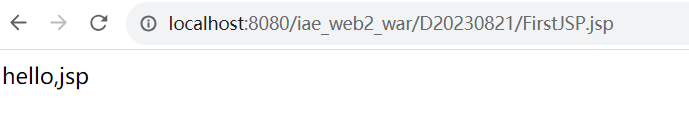
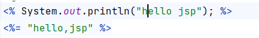
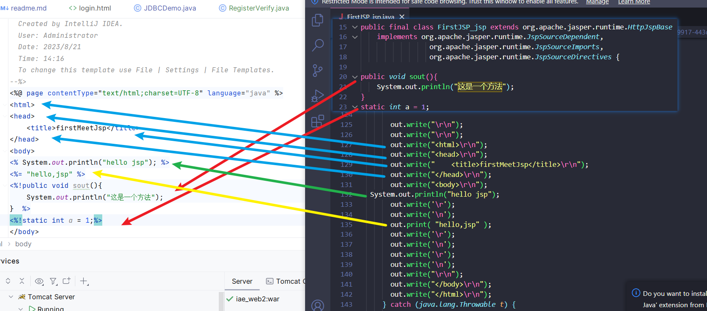

## 使用JSP

### JSP本质上是servlet

首次运行时，会自动编译，先转换为java，然后编译成为class（为了方便在servlet中取代繁琐的代码

编译位置C:\Users\Administrator\AppData\Local\JetBrains\IntelliJIdea2023.1\tomcat\4a555ef3-d10d-4e88-9917-443c0924e5a4

如图所示

上面一条代表将其在.java文件中原封不动的输出

而下面的会自动转译为out.write("hello,jsp")(和writer.write完全一样)

对应代码在自动编译好的java文件中对应的代码如下